# :blue_book: azure cloud devops 
## project: deploy linux vm and host a website using azure
- create resourse group
- create ubuntu virtual machine
- connect using ssh
- install nginx
- open port 80 in nsg
- access the website using PUBLIC IP
---
### :computer: commnad i run 
- ssh azureuser@PUBLIC_IP
- sudo apt update
- sudo apt install nginx -y
- sudo systemctl status nginx
- curl localhost
  :check_mark:
## Screenshots
---
### Azure Virtual Machine Overview
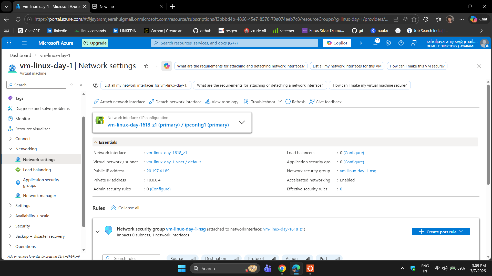

### Network Security Rule (Port 80)
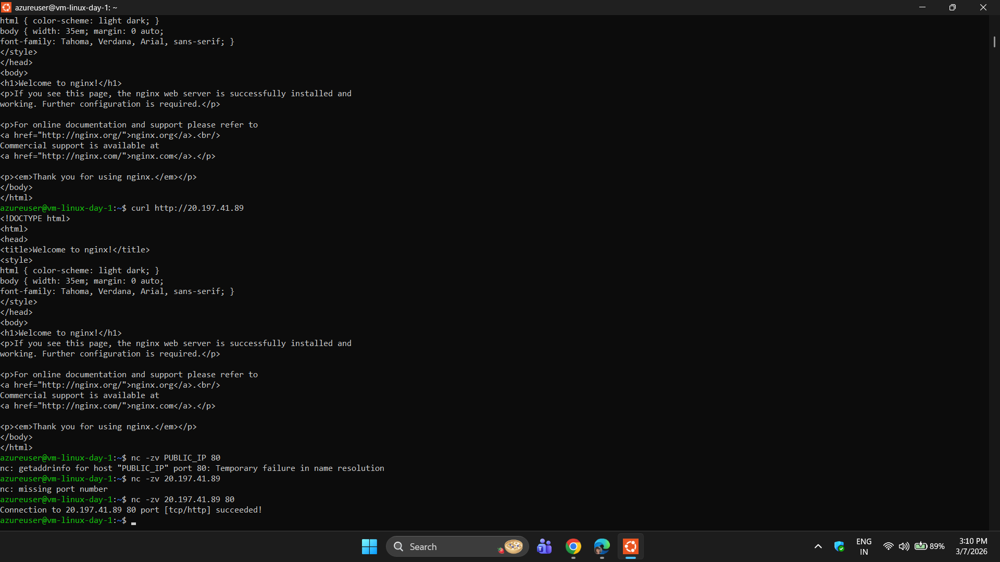

:check_mark:

---
# :blue_book: azure cloud devops 
-today i have praactised manging azure resources using cli instead of azure portal the goal was to understand to deploy
## :cloud: topics i have covered

- azure cli installation
- azure cli login
- creating resource groups
- connecting a virtual machine
- opening port 80 for web traffic
- installing nginx
- installing docker

  ### :computer: step 1 installing of azure cli

  #### i used command curl -sL https://aka.ms/InstallAzureCLIeb | sudo bash

  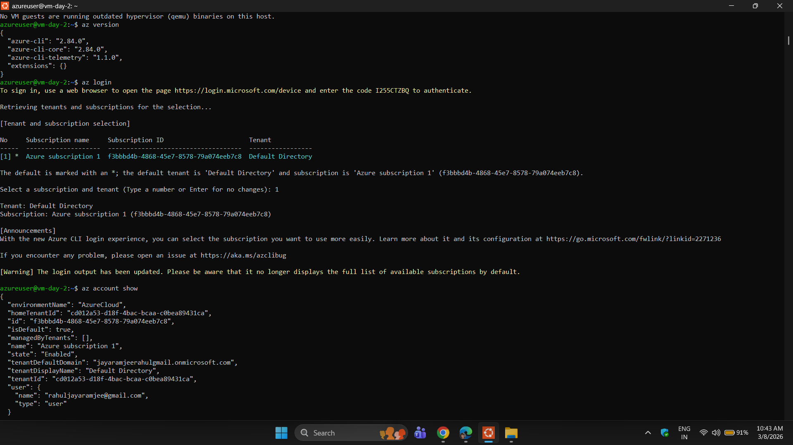

  #### login to azure cli as login --use-device-code

  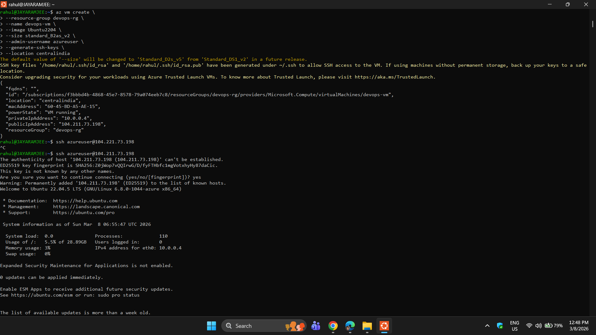

  #### created resource group az group create --name devops-rg --location centralindia

   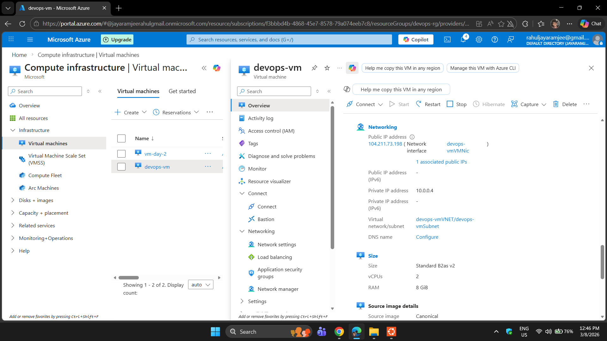

  az vm create \
--resource-group devops-rg \
--name devops-vm \
--image Ubuntu2204 \
--size Standard_B2as_v2 \
--admin-username azureuser \
--generate-ssh-keys \
--location centralindia 

  

   #### open port 80
  az vm open-port \
--resource-group devops-rg \
--name devops-vm \
--port 80


#### install of nginx 
sudo apt update
sudo apt install nginx -y
sudo systemctl start nginx

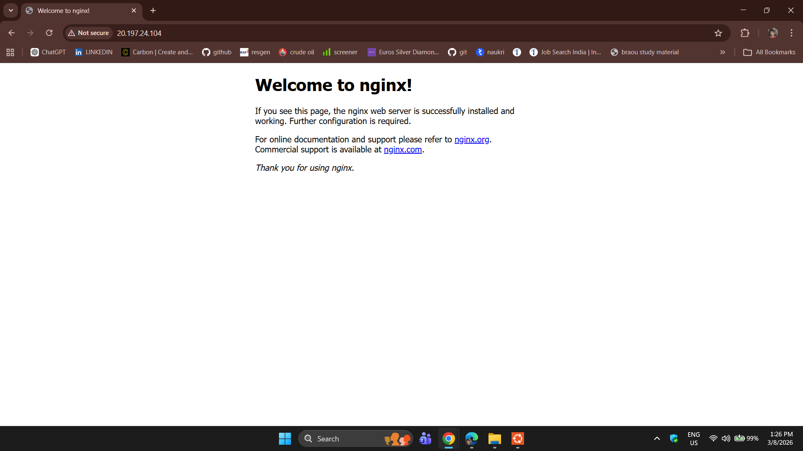

 with the help of ip address we can browse and it willl show nginx is installed

:check_mark:

---

 # 🖥️  docker basic level
 ---
## Docker Basics for practsing
---

### :computer: Commands learned:

- docker run -d -p 8000:80 nginx
- docker ps
- docker ps -a
- docker stop <container-id>
- docker start <container-id>
- docker rm <container-id>
- docker container prune
- learn docker volume and networking
---
### :cloud: Concept learned and did hands on practise :
- Docker container
- Port mapping
- Running Nginx in container

Example:

Host Port → Container Port

8000:80

Access in browser:

http://localhost:8000
### Docker Container Stop

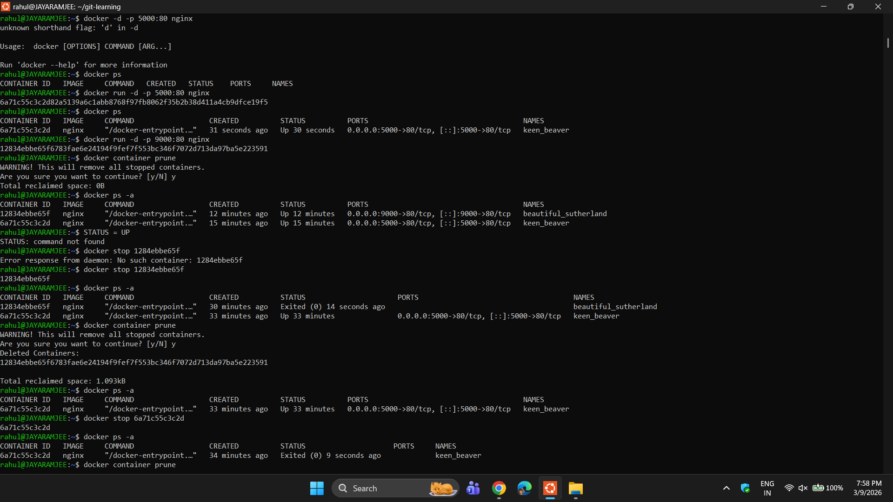

### Docker Volume Example

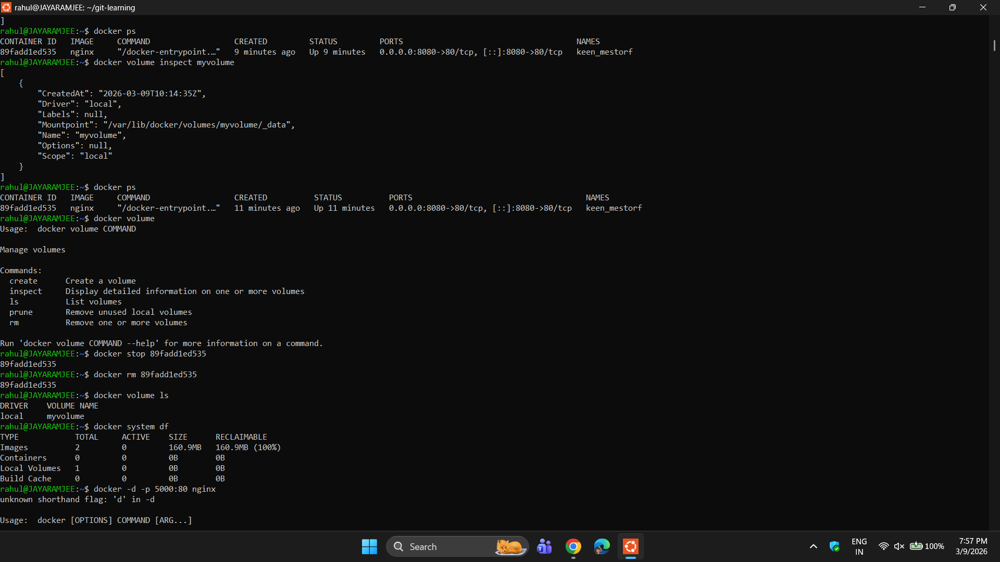 

:check_mark:

---

# :blue_book: same day i learn git and github baics
---
## :computer: Commands learned:

git init
git status
git add
git commit
git log
git remote add origin
git branch -M main
git push

Concept learned:
- Local repository
- Remote repository
- Git commit history
- Uploading project to GitHub
### Git Push to GitHub

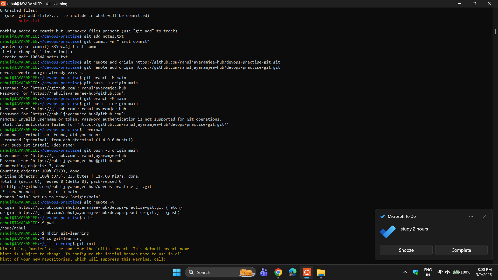

### Git Repository Setup

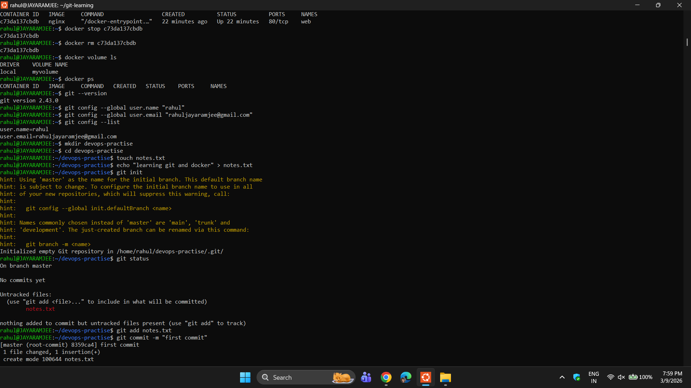
:check_mark:

---

# :blue_book:  – Dockerfile and Custom Image
---
## Objective

Learn how to build a custom Docker image using a Dockerfile and run a container.

---
## Steps Performed

1. Created a project directory
2. Added a simple HTML webpage
3. Wrote a Dockerfile using nginx base image
4. Built a Docker image
5. Ran a container using the image
6. Accessed the application through the browser
---
## :computer: Commands Used

docker build -t rahul-nginx .
docker run -d -p 8080:80 rahul-nginx
docker ps
curl localhost:8080
:check_mark:

---

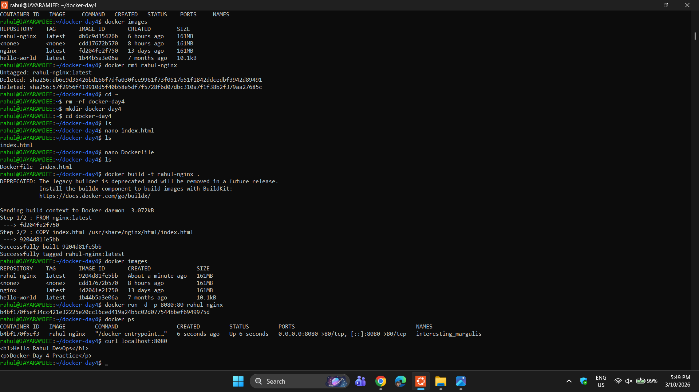

## Result

Successfully created a custom nginx container serving a personal HTML page.

---
# :blue_book:  – learing python to automation and scripting 
 instaled python3 in the ubuntu terminal in virtual environment python3 -m venv myenv
 ### python varaibles 

## what i learnt in the python variable


## Variables

Variables store values.

```python
name = "Rahul"
age = 40

print(f"My name is {name} and my age is {age}")
```

## :computer: For Loop (for item in list)

Used to repeat an action for each item in a list.

```python
servers = ["web1", "web2", "db1"]

for server in servers:
    print(f"Checking server {server}")
```
---
💻 For Loop (for item in list)
Used to repeat an action for each item in a list.

servers = ["web1", "web2", "db1"]

for server in servers:
    print(f"Checking server {server}")
---
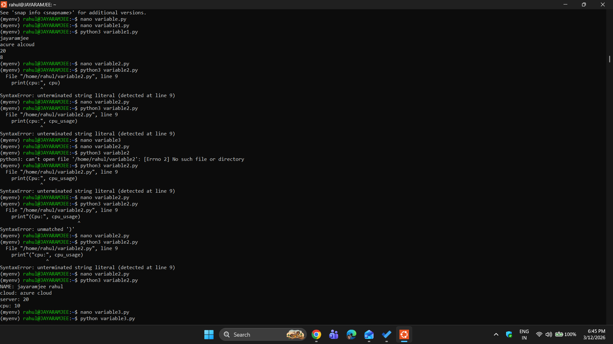


# :computer:  Python Practice (Dictionaries & Loops)

Today I practiced Python dictionaries and loops, which are useful for handling server data in DevOps.

## 1. Dictionary Example

```python
server = {"name": "web1", "ip": "10.0.0.1", "status": "running"}

print(server["name"])
print(server["ip"])
```

## 2. Loop Example

```python
servers = ["web1", "web2", "db1"]

for s in servers:
    print("Checking server:", s)
```

## 3. Dictionary + Loop Together

```python
servers = [
    {"name": "web1", "ip": "10.0.0.1"},
    {"name": "web2", "ip": "10.0.0.2"}
]

for server in servers:
    print(server["name"], server["ip"])
```

# 💻 Python File Handling (for DevOps / Azure)

## Why File Handling?

In DevOps we often read files like:

* server lists
* deployment logs

Python helps automate these tasks.

## Example 1 – Writing to a File

```python
file = open("servers.txt", "w")

file.write("web1\n")
file.write("web2\n")
file.write("db1\n")

file.close()
```

Explanation:

* `"w"` → write mode (creates file or overwrites)
* `\n` → new line
* This creates a file called **servers.txt**

Output file:

```
web1
web2
db1
```


--------------------------------------------------

## 3. Appending to a File
Used to add new content without deleting existing data.

Example:
```
file = open("example.txt", "a")
file.write("\nNew line added")
file.close()
```

Mode:
"a" → append (adds content to the end)

--------------------------------------------------
Summary

r → read file  
w → write file (overwrite)  
a → append to file


---


# 📘 Git = track code changes

- git init → start repo
- git clone → copy repo
- git status → check changes
- git add . → stage files
- git commit -m "msg" → save
- git push → upload
- git pull → get latest

## 💻 Practice

mkdir demo
cd demo
git init

echo "hello" > file.txt
git add .
git commit -m "first commit"
### made an repo in my github and clering in the end of the day

Connect GitHub repo and run:
git push

Flow: Code → Add → Commit → Push

---

# 💻 practising and breaking things down and fixing it
# Mistakes I Faced

- Forgot git add before commit
- Wrong commit message
- Tried running git without initializing repo
  
  ### its really important to use command before commit

   ---
  # 📑 practising again the python codes for perfectiion

  # VARIABLES
```
env_name = "prod"
cpu_readings = [55, 23, 87, 12, 67]

print("Environment:", env_name)

# SORTING
cpu_readings.sort()

print("Sorted CPU readings:", cpu_readings)

```

```
# LOOP
for value in cpu_readings:
    if value > 70:
        print("High:", value)
    else:
        print("OK:", value)
```
## 💻 out-put of the python code 

```
Environment: prod
Sorted CPU readings: [12, 23, 55, 67, 87]
OK: 12
OK: 23
OK: 55
OK: 67
High: 87

```
✔️


# practsing docker for perfection 
 # Docker Day 1

Docker runs applications in containers with all dependencies.
Images are blueprints, containers are running instances.
Pulled nginx image and ran it using docker run.
Used docker ps to check and docker stop to stop containers.
Learned basic Docker workflow.

